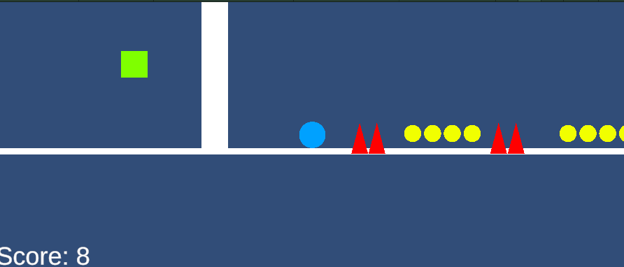

ゲーム制作技術総合実習 個人ワーク
（Circle, Triangle, Squareを使用した2Dゲーム）

# 3 Shape Shifter's

## ゲームの内容
◯,△,□を使ったアクションゲーム。
コイン(黄色のCircle)を集めて、ハイスコアを狙うゲーム

## 操作説明
A,Dキーで左右に移動する。（◯のみ）
スペースキーでジャンプができる。（△のみ）
□は全物体を透過できる。
1で操作キャラクターを◯に変更。
2で操作キャラクターを□に変更。
3で操作キャラクターを△に変更。
